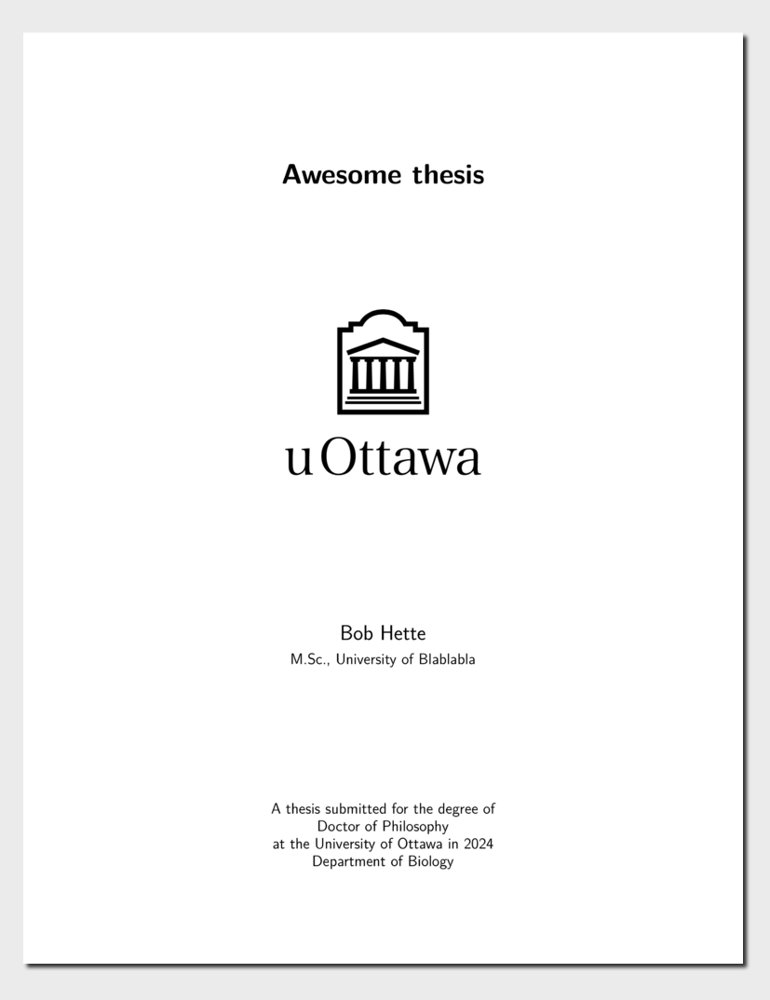

<!-- README.md is generated from README.qmd. Please edit that file -->

# uOttawa (biology) Thesis Template

This is a Quarto template that assists you in creating a University of
Ottawa thesis. You can fork or download the repository to get started
but the recommended way is simply to use the quarto function within R or
the system shell to install and use the template

``` r
quarto::quarto_use_template("juliengamartin/biouOthesis")
```

or in a terminal

``` bash
quarto use template("juliengamartin/biouOthesis")
```

[](examples/template.pdf)
